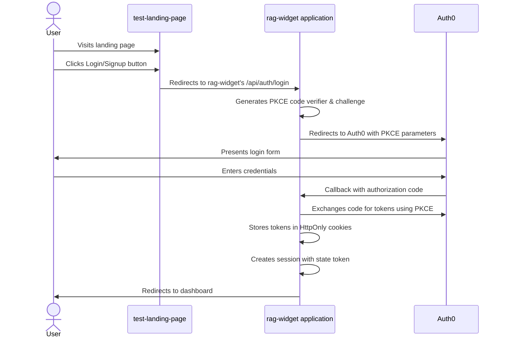

# RAG Widget Authentication Flow

This document describes the authentication flow from the test-landing-page through the rag-widget application, utilizing the PKCE flow.

## Overview

The authentication system uses Auth0 for identity management with a two-part architecture:
1. **test-landing-page**: Public-facing landing page with login/signup buttons
2. **rag-widget**: Admin portal application that handles authentication directly using PKCE

## Authentication Flow Diagram



## Detailed Flow

### 1. User Interaction with Landing Page

The user begins on the test-landing-page where they can:
- Click "Log In", "Sign Up", or "Get Started" buttons
- These buttons link directly to the rag-widget's Auth0 login endpoint: `http://localhost:3000/api/auth/login`

### 2. PKCE Authentication Flow (handled by rag-widget)

Once redirected to the rag-widget's login endpoint:

1. **Initiate Login with PKCE**:
   - The `initiateLogin` function in `authController.ts` is triggered
   - Generates a PKCE code verifier and challenge
   - Stores the code verifier in the session
   - Redirects to Auth0 with the PKCE parameters

2. **Auth0 Authentication**:
   - Auth0 presents the login form to the user
   - User enters credentials and authenticates
   - Auth0 redirects back to the callback URL with an authorization code

3. **Callback Handling**:
   - The `handleCallback` function processes the callback
   - Exchanges the authorization code for tokens using PKCE
   - Verifies the ID token
   - Stores the refresh token in an HttpOnly cookie
   - Generates a one-time state token for the frontend
   - Redirects to the frontend with only the state token in the URL

4. **Frontend Token Exchange**:
   - The frontend exchanges the state token for the access token
   - The server validates the state token and returns the access token
   - The frontend can now make authenticated API requests

5. **Dashboard Load**:
   - After successful authentication, the user is redirected to the dashboard
   - Dashboard loads user data and displays it

### 3. Session and Token Management

- **Access Tokens**: Short-lived (1 hour), used for API requests
- **Refresh Tokens**: Stored in HttpOnly cookies, used to obtain new access tokens
- **State Tokens**: One-time use tokens for secure frontend/backend communication
- **PKCE**: Prevents authorization code interception attacks
- **Refresh Token Rotation**: Enhances security by issuing a new refresh token when refreshing access tokens

## API Routes Related to Authentication

```
GET  /api/auth/login          - Initiate login with PKCE
GET  /api/auth/callback       - Handle Auth0 callback after login
POST /api/auth/token-exchange - Exchange state token for access token
POST /api/auth/refresh        - Refresh access token
GET  /api/auth/profile        - Get user profile (protected)
POST /api/auth/logout         - Logout and clear auth cookies
```

## Security Considerations

- No sensitive tokens in URLs (prevents token leakage)
- Access tokens are short-lived (typically 1 hour)
- Refresh tokens are stored in HttpOnly cookies to prevent XSS attacks
- CSRF protection with state parameters
- Refresh token rotation for enhanced security
- One-time use state tokens with short expiration times
- PKCE flow prevents authorization code interception attacks

This authentication flow provides a secure, modern approach to user authentication with proper separation between the public-facing landing page and the authenticated admin portal.