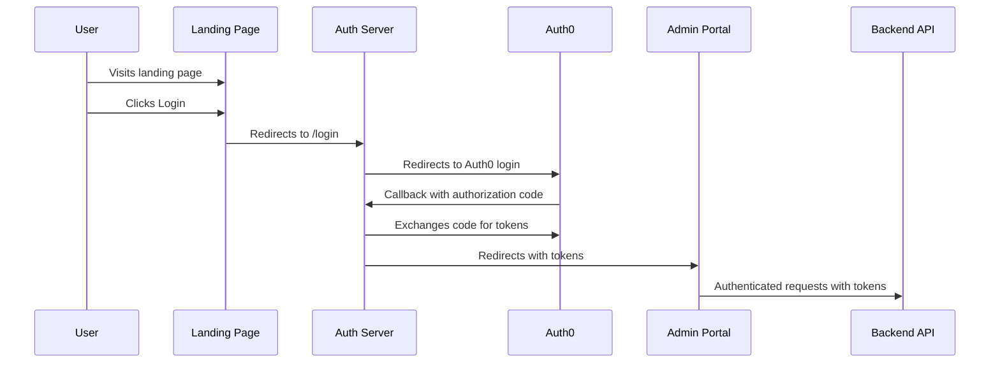

# YouTube RAG Widget - System Architecture

## Overview

The YouTube RAG Widget is a Software-as-a-Service (SaaS) application that enables YouTube content creators to add an AI-powered Q&A widget to their websites. The system processes YouTube videos, generates embeddings from transcripts, and provides a query interface for website visitors to ask questions about the video content.

## System Components


### Core Components

1. **Landing Page** (`/test-landing-page`)
   - Public-facing website for user signup/login
   - Authentication gateway using Auth0
   - Redirects to Admin Portal after successful authentication

2. **Admin Portal** (`/rag-widget`)
   - Dashboard for content creators to manage channels and widgets
   - Configuration interface for embedding settings
   - Analytics and usage statistics

3. **Widget** (`/rag-widget/public/widget`)
   - Embeddable JavaScript component for third-party websites
   - Provides Q&A interface for end users
   - Communicates with backend API for query processing

4. **Backend Services**
   - YouTube data fetching and processing
   - Transcription services
   - Embedding generation
   - Vector database integration
   - Query processing

### Database Structure

- **PostgreSQL**: Relational database for user data, configurations, and metadata
- **Vector Database**: Specialized database for storing and querying embeddings

## Technology Stack

### Frontend
- React 19
- TypeScript
- Tailwind CSS (Landing Page)
- Webpack for bundling

### Backend
- Node.js with Express
- TypeScript
- Sequelize ORM
- Auth0 for authentication

### Data Processing
- YouTube API for video data
- Transcription services
- Embedding generation (OpenAI compatible)
- Vector database for RAG queries

### Infrastructure
- Docker containerization
- Docker Compose for local development

## Authentication Flow



## Data Flow

1. **Video Processing Pipeline**
   ```mermaid
   graph LR
       A[YouTube Channel] --> B[Fetch Videos]
       B --> C[Process Transcripts]
       C --> D[Generate Embeddings]
       D --> E[Store in Vector DB]
   ```

2. **Query Processing**
   ```mermaid
   graph LR
       A[User Question] --> B[Widget Frontend]
       B --> C[Query API]
       C --> D[Vector Search]
       D --> E[Format Response]
       E --> B
   ```

## Communication Interfaces

| Component | Exposes | Consumes |
|-----------|---------|----------|
| Landing Page | User authentication UI | Auth Server API |
| Auth Server | Authentication API | Auth0 Service |
| Admin Portal | Dashboard UI | Backend API |
| Widget | Embeddable script | Query API |
| Backend API | RESTful endpoints | YouTube, Vector DB, Auth services |

## Deployment Architecture

For production deployment, the system uses containerized microservices orchestrated with Docker:

- Frontend containers (Landing Page, Admin Portal)
- Backend API container
- Auth Server container
- Database containers (PostgreSQL, Vector DB)

## Security Considerations

- Auth0 for identity management and JWT-based authentication
- CORS configuration to prevent unauthorized API access
- Rate limiting to prevent abuse
- Secure cookie handling for session management
- Environment-based configuration for secrets