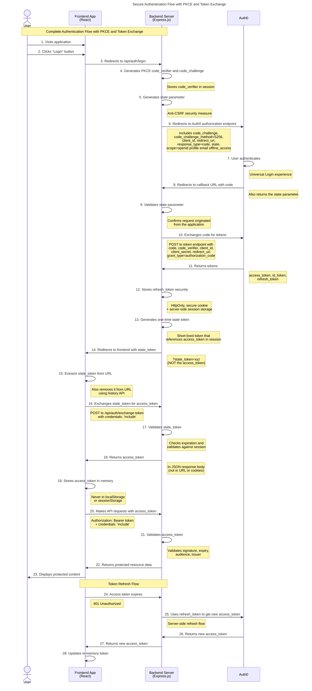

# Authentication Flow Documentation

## Overview

This document describes the secure authentication flow in the YouTube RAG Widget application. The system uses Auth0 as the identity provider and implements OAuth 2.0 Authorization Code Flow with PKCE (Proof Key for Code Exchange) coupled with a secure token exchange mechanism.

## Authentication Sequence Diagram

The following diagram illustrates our secure authentication flow, which incorporates PKCE for enhanced security and a server-side token exchange mechanism that avoids exposing sensitive tokens in URLs or browser storage.




## Technologies Used

1. **React** - Frontend framework
2. **Express.js** - Backend framework
3. **Auth0** - Identity platform with OAuth 2.0/OIDC implementation
4. **JWT** - Token format for authentication/authorization
5. **JWKS** - JSON Web Key Set for verifying token signatures
6. **PKCE** - Proof Key for Code Exchange for enhanced OAuth security

## Detailed Flow Description

### Initial Authentication

1. **User Login Initiation**:
   - User visits the application and clicks the "Login" button
   - The React application redirects to the backend's login route

2. **PKCE Preparation**:
   - Backend generates a random `code_verifier` string
   - Backend creates a `code_challenge` by hashing the verifier with SHA-256 and base64url encoding it
   - Backend stores the `code_verifier` in the server-side session for later use
   - Backend also generates a random `state` parameter to prevent CSRF attacks

3. **Auth0 Redirection**:
   - Backend redirects to Auth0 authorization endpoint with PKCE parameters:
     - `response_type=code`
     - `code_challenge={derived challenge}`
     - `code_challenge_method=S256`
     - `client_id={app client id}`
     - `redirect_uri={callback URL}`
     - `scope=openid profile email offline_access`
     - `state={random state value}`

4. **User Authentication**:
   - User authenticates using Auth0's Universal Login
   - Auth0 redirects back to the application's callback URL with an authorization code and the state parameter

### Token Exchange Flow

5. **Secure Code Exchange**:
   - Backend validates the returned state parameter matches the one sent
   - Backend exchanges the authorization code for tokens using PKCE:
     - Sends the original `code_verifier` (not the challenge)
     - Auth0 verifies this matches the original challenge
     - If valid, Auth0 returns access, ID, and refresh tokens

6. **Secure Token Storage**:
   - Backend stores the refresh token in HttpOnly, Secure, SameSite cookies
   - For enhanced security, refresh token is also stored in server-side session storage
   - Access token is temporarily stored in the server-side session

7. **One-Time State Token**:
   - Backend generates a short-lived, one-time-use state token
   - This token references the access token in the session
   - Backend redirects to the frontend with only this state token in the URL query parameter

### Frontend Token Handling

8. **State Token Exchange**:
   - Frontend extracts the state token from the URL and removes it using history API
   - Frontend makes a secure POST request to `/api/auth/exchange-token` with the state token
   - Backend validates the state token and returns the actual access token in the response body
   - Frontend stores this access token in memory only (not localStorage or sessionStorage)

9. **Authenticated API Requests**:
   - Frontend includes the access token in the Authorization header as a Bearer token
   - Frontend also includes credentials to send cookies with each request
   - Backend validates the token signature, expiration, audience, and issuer
   - Backend processes the request if valid and returns the protected resource

## Security Considerations

### Enhanced OAuth Security with PKCE

PKCE (RFC 7636) protects against authorization code interception attacks. It's especially important for public clients (like SPAs) that can't securely store client secrets.

Key security benefits:
- Prevents authorization code interception attacks
- Secures the flow even without client secrets
- Ensures only the original requestor can exchange the code for tokens

### Secure Token Storage

Our implementation follows security best practices for token storage:

- **Access Tokens**: Stored only in memory variables (not persisted)
- **Refresh Tokens**: Stored in HttpOnly, Secure, SameSite=Strict cookies and server-side storage
- **ID Tokens**: Used only to extract user info, then discarded

### Avoiding URL Token Exposure

The implementation avoids exposing sensitive tokens in URLs by using a one-time state token exchange:

- Only a non-sensitive state token appears in the URL
- This state token is exchanged server-side for the actual access token
- The exchange happens over a secure, authenticated channel
- The state token is short-lived and one-time use only

### Comprehensive Token Validation

Token validation includes multiple security checks:

- **Signature Verification**: Using JWKS from Auth0
- **Expiration/Timing**: Validate `exp`, `iat`, and `nbf` claims
- **Issuer Validation**: Ensure token comes from expected Auth0 tenant
- **Audience Validation**: Verify token is intended for this API
- **Scope Validation**: Check that token has required permissions

### Token Refresh Mechanism

The system includes a proper token refresh flow:

1. **Access Token Expiration Detection**:
   - Frontend detects 401 Unauthorized responses
   - Alternatively, proactively refreshes based on token expiration time

2. **Backend-Managed Refresh**:
   - Frontend calls `/api/auth/refresh` endpoint
   - Backend uses the refresh token from the HttpOnly cookie
   - Backend obtains a new access token from Auth0
   - Backend returns the new access token to the frontend
   - Frontend updates its in-memory token store

## Implementation Details

### Backend PKCE Implementation

```typescript
// Generate PKCE code verifier and challenge
const codeVerifier = generateCodeVerifier();
const codeChallenge = generateCodeChallenge(codeVerifier);

// Store the code verifier in session to use during callback
req.session!.codeVerifier = codeVerifier;

// Generate state parameter to prevent CSRF attacks
const state = crypto.randomBytes(16).toString('hex');
req.session!.authState = state;

// Construct Auth0 authorization URL with PKCE parameters
const authUrl = `https://${config.auth.auth0.domain}/authorize?` +
  `response_type=code&` +
  `code_challenge=${codeChallenge}&` +
  `code_challenge_method=S256&` +
  `client_id=${config.auth.auth0.clientId}&` +
  `redirect_uri=${encodeURIComponent(config.auth.auth0.callbackUrl)}&` +
  `scope=openid%20profile%20email%20offline_access&` +
  `state=${state}`;

// Redirect user to Auth0 login
res.redirect(authUrl);
```

### State Token Exchange

Backend generates and stores a state token that references the access token:

```typescript
// Generate one-time state token for redirect
const stateToken = crypto.randomBytes(32).toString('hex');
const stateTokenExp = Date.now() + (5 * 60 * 1000); // 5 minutes

// Store in server-side session
req.session!.stateToken = {
  value: stateToken,
  exp: stateTokenExp,
  accessToken: tokenResponse.access_token
};

// Redirect to frontend with state token (never the access token)
const redirectUrl = `${frontendUrl}/dashboard?state_token=${stateToken}`;
res.redirect(redirectUrl);
```

Frontend exchanges this state token for the actual access token:

```typescript
// Extract state token from URL
const urlParams = new URLSearchParams(window.location.search);
const stateToken = urlParams.get('state_token');

if (stateToken) {
  // Exchange state token for access token
  try {
    const response = await fetch('/api/auth/exchange-token', {
      method: 'POST',
      headers: {
        'Content-Type': 'application/json'
      },
      credentials: 'include',
      body: JSON.stringify({ stateToken })
    });
    
    if (!response.ok) {
      throw new Error(`Failed to exchange token: ${response.status}`);
    }
    
    const data = await response.json();
    // Store the access token in memory only
    setAccessToken(data.accessToken);
    
    // Clean up the URL to avoid confusion
    const url = new URL(window.location.href);
    url.searchParams.delete('state_token');
    window.history.replaceState({}, document.title, url.toString());
  } catch (error) {
    console.error('Failed to exchange state token:', error);
  }
}
```

### Authenticated API Requests

Using the authentication utility to include the access token in all API requests:

```typescript
// Authenticated fetch utility
const authenticatedFetch = async (url: string, options: RequestInit = {}): Promise<Response> => {
  // Start with the provided options or empty object
  const fetchOptions: RequestInit = { ...options };
  
  // Add credentials to include cookies
  fetchOptions.credentials = 'include';
  
  // Initialize headers if not provided
  if (!fetchOptions.headers) {
    fetchOptions.headers = {};
  }

  // Add Authorization header with Bearer token if we have an access token
  if (authState.accessToken) {
    (fetchOptions.headers as Record<string, string>)['Authorization'] = `Bearer ${authState.accessToken}`;
  } else {
    console.warn(`No access token available for request to ${url}`);
  }

  // Make the request
  return fetch(url, fetchOptions);
};

// Example API call
const fetchUserProfile = async (): Promise<UserProfileResponse['user']> => {
  const response = await authenticatedFetch('/api/auth/profile');
  
  if (!response.ok) {
    throw new Error('Failed to fetch user profile');
  }
  
  const data = await response.json();
  return data.data.user;
};
```

## Token Refresh Implementation

```typescript
// Token refresh endpoint on backend
export const refreshToken = async (req: Request, res: Response, next: NextFunction) => {
  try {
    // Get refresh token from HttpOnly cookie
    const refreshToken = req.cookies.refresh_token;
    
    if (!refreshToken) {
      throw new AppError('No refresh token provided', 401);
    }
    
    // Exchange refresh token for new access token and potentially new refresh token
    const tokenResponse = await auth0Service.refreshToken(refreshToken);
    
    // With refresh token rotation enabled, Auth0 will always return a new refresh token
    // Always update the refresh token cookie with the new value
    if (tokenResponse.refresh_token) {
      res.cookie('refresh_token', tokenResponse.refresh_token, {
        httpOnly: true,
        secure: process.env.NODE_ENV === 'production',
        sameSite: 'lax',
        maxAge: 30 * 24 * 60 * 60 * 1000 // 30 days
      });
    }
    
    // Return the new access token
    return res.json({
      status: 'success',
      data: {
        accessToken: tokenResponse.access_token
      }
    });
  } catch (error) {
    next(error);
  }
};
```

## Conclusion

This authentication flow combines industry best practices to provide a secure authentication experience:

1. **Uses PKCE** to prevent code interception attacks
2. **Never exposes tokens in URLs** by using a state token exchange
3. **Stores tokens securely** with refresh tokens in HttpOnly cookies and access tokens in memory
4. **Validates tokens comprehensively** on the backend
5. **Supports token refresh** for seamless user experience
6. **Maintains security** across the entire authentication lifecycle

By implementing this secure authentication flow, the YouTube RAG Widget application protects user data and prevents common authentication attacks while providing a smooth user experience.