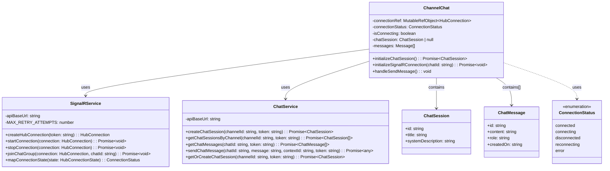
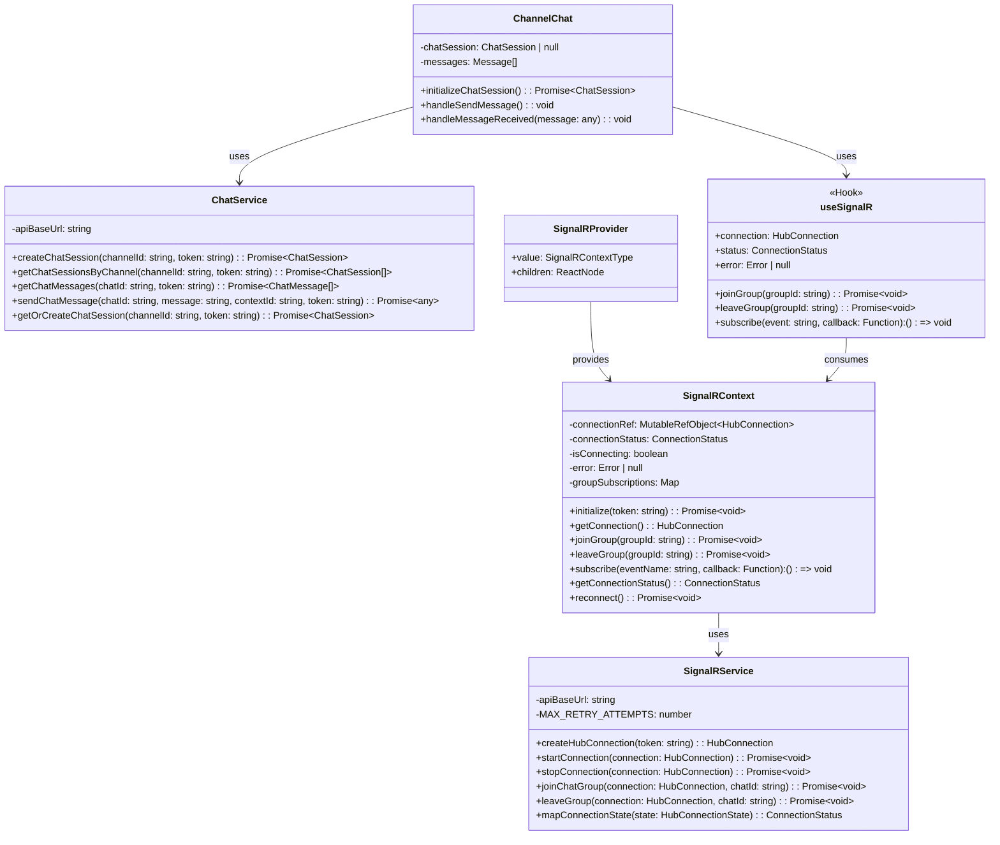

# SignalR Architecture Analysis

## Current Implementation

The current implementation follows a direct component-to-service pattern where each chat component instance creates and manages its own SignalR connection.

### Key Observations in Current Implementation

1. **Direct Coupling**: The ChannelChat component directly depends on both SignalRService and ChatService.

2. **Connection Management**: Each ChannelChat instance manages its own connection lifecycle:
   - Creates a connection in `initializeSignalRConnection()`
   - Tracks connection state with local state variable
   - Handles cleanup in useEffect return function
   - Manages reconnection logic independently

3. **Race Condition Handling**: Currently implemented with flags in the component itself:
   - Uses `isConnecting` state to prevent multiple simultaneous connection attempts
   - Uses `hasInitializedRef` to track if connection was already established

4. **Potential Issues**:
   - Each component instance creates its own SignalR connection
   - If multiple chat windows are open, multiple connections are established
   - Connection management logic is duplicated across components
   - Cleanup logic is tied to component unmount, which can be problematic during navigation

## Proposed Architecture

The proposed architecture involves creating a central SignalR context provider that manages the connection for the entire application.

### Benefits of Proposed Architecture

1. **Centralized Connection Management**:
   - Single SignalR connection for the entire application
   - Connection state managed in one place
   - Automatic reconnection logic in one place
   - Proper cleanup when the application unmounts

2. **Group Subscription Management**:
   - Tracks which components have joined which groups
   - Only leaves a group when no components are subscribed to it
   - References counted subscriptions prevent premature group leaving

3. **Simplified Component Logic**:
   - Components don't need to manage connection lifecycle
   - Components only need to join/leave groups and subscribe to events
   - Cleaner separation of concerns

4. **Improved Performance**:
   - Single WebSocket connection for the entire application
   - Reduced network overhead
   - Reduced server-side resources

5. **Better Error Handling**:
   - Centralized error handling and recovery
   - Components can react to connection status changes

6. **Multiple Chat Support**:
   - Multiple chat components can share the same connection
   - Each component only needs to join its specific chat group
   - Messages are properly routed to the correct component

### Implementation Considerations

1. **React Context API**:
   - The SignalRContext provides the connection and methods to all components
   - useSignalR hook simplifies access to the context

2. **Connection Lifecycle**:
   - Connection is established when the app initializes
   - Connection is maintained across component mounts/unmounts
   - Connection is properly cleaned up when the app unmounts

3. **Group Management**:
   - Components join groups when mounted
   - Components leave groups when unmounted
   - Reference counting prevents leaving groups prematurely

4. **Event Handling**:
   - Components subscribe to specific events (e.g., 'ReceiveMessage')
   - Each subscription returns a cleanup function
   - Components filter messages based on their chatId

5. **Error Handling and Recovery**:
   - Central error handling with automatic reconnection
   - Components can react to connection status changes
   - Exponential backoff and retry logic in one place

This architecture provides a more robust, efficient, and maintainable solution for managing SignalR connections in a React application with multiple chat components.