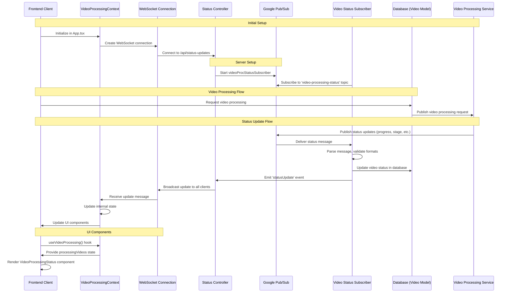

# WebSocket Status Updates Architecture

This document describes the architecture and implementation of the real-time video processing status updates system using WebSockets.

## System Architecture



## Core Components

### 1. Google Pub/Sub

The messaging service that receives updates from the video processing cluster.

- **Topic**: `video-processing-status`
- **Subscription**: `video-processing-status-subscription`
- **Configuration**: Defined in environment.ts under `config.gcp.pubsub.videoProcessingStatusTopic`

### 2. VideoProcStatusSubscriber

Server-side service that manages the connection to Google Pub/Sub and processes incoming messages.

**Key Responsibilities**:
- Subscribe to the Google Pub/Sub topic for video processing status
- Handle message normalization (maps different field formats)
- Update the database with status information
- Emit events for the WebSocket server

**Message Format Compatibility**:
- Handles field name mapping between different formats:
  - `video_id` → `videoId`
  - `progress_percent` → `progress`
  - `current_stage` → `stage`

**File Location**: `/src/services/processing/videoProcStatusSubscriber.ts`

### 3. WebSocket Server

Set up in the status controller to manage client connections and broadcast updates.

**Key Features**:
- Endpoint: `/api/status-updates`
- Connection tracking with unique IDs
- Broadcasting status updates to all connected clients
- Error handling and connection state monitoring

**File Location**: `/src/api/controllers/statusController.ts`

### 4. VideoProcessingContext (Client-Side)

React context provider that establishes the WebSocket connection and manages state.

**Key Features**:
- Creates and maintains a single WebSocket connection
- Manages the state of processing videos
- Provides React context for components to access video status
- Handles WebSocket lifecycle (connection, disconnection, reconnection)
- Persists status in localStorage for resilience

**UI State Management**:
- `processingVideos`: Record of video IDs to status objects
- `registerProcessingVideo`: Register a video for tracking
- `updateProcessingStatus`: Update a video's status
- `clearStaleProcessingVideos`: Clean up old processing states

**File Location**: `/src/contexts/VideoProcessingContext.tsx`

### 5. VideoProcessingStatus Component

A reusable UI component for displaying processing status.

**Features**:
- Visual representation of processing status (pending, processing, completed, failed)
- Progress bar for processing videos
- Estimated time remaining calculation
- Current processing stage display
- Error message display for failed processing

**File Location**: `/src/components/video-processing-status.tsx`

## Implementation Details

### Single WebSocket Connection

The VideoProcessingProvider is placed at the App level to ensure only one WebSocket connection exists across the application. This fixed a memory leak where multiple connections were being created.

```tsx
// In App.tsx
<VideoProcessingProvider>
  <Switch>
    {/* Routes */}
  </Switch>
</VideoProcessingProvider>
```

### Robust Error Handling

- Connection errors are tracked and logged
- Automatic reconnection attempts when disconnected
- Graceful handling of malformed messages
- Message acknowledgment to prevent redelivery loops
- UUID validation to prevent database errors

### Status Updates Flow

1. Video processing service sends status updates to Google Pub/Sub
2. VideoProcStatusSubscriber receives and normalizes messages
3. Database is updated with current status
4. StatusUpdate event is emitted to the WebSocket server
5. Updates are broadcast to all connected clients
6. VideoProcessingContext receives updates and updates internal state
7. UI components re-render with new status information

### State Management and UI Experience

- **Animation States**: Temporary `finalState` flag for animations
- **Local Storage Persistence**: Status persists across page refreshes
- **Completed/Failed State**: Permanent storage for reference
- **Cleanup**: Automatic removal of stale processing states (after 10 minutes)

### Development Tools

For easier debugging and testing, the implementation includes:

- **Debug Panel**: Connection status and message counts (in development mode)
- **Test Utilities**: `simulateStatusUpdate` function for testing
- **Console Access**: Global `__VIDEO_PROCESSING_DEBUG__` and `__VIDEO_PROCESSING_CONTEXT__` objects
- **Detailed Logging**: Comprehensive logging for troubleshooting

## Recent Improvements

### WebSocket Connection Management (2025-04-08)
- Relocated VideoProcessingProvider to App.tsx to prevent multiple connections
- Enhanced WebSocket cleanup logic to properly close connections in all states
- Added unique identifiers for WebSocket connections
- Added permanent storage of completed/failed videos in state

### Message Format Compatibility (2025-04-11)
- Added support for handling different message formats
- Fixed field name mapping between received messages and expected format
- Enhanced video lookup to work with both database IDs and YouTube IDs
- Fixed UUID validation to prevent database errors when using YouTube IDs

## Testing

To test the WebSocket connection and status updates:

1. Open browser console in development environment
2. Access the VideoProcessingContext debug object:
   ```javascript
   window.__VIDEO_PROCESSING_DEBUG__
   ```
3. Simulate a status update:
   ```javascript
   window.__VIDEO_PROCESSING_DEBUG__.simulateMessage('video-id-here', 'completed')
   ```
4. View active connections and status in the debug panel (bottom right of screen)

## Troubleshooting

### Common Issues

1. **No Status Updates**
   - Check WebSocket connection status in debug panel
   - Verify Pub/Sub subscription is active
   - Check for error messages in server logs

2. **Multiple WebSocket Connections**
   - Ensure VideoProcessingProvider is only included once at the App level
   - Check for nested providers in the component tree

3. **Memory Leaks**
   - Ensure socket cleanup on unmount is functioning
   - Check browser memory usage to verify connections are closed

4. **Invalid Status Updates**
   - Check message format compatibility in VideoProcStatusSubscriber
   - Verify ID formats (UUID vs. YouTube ID)