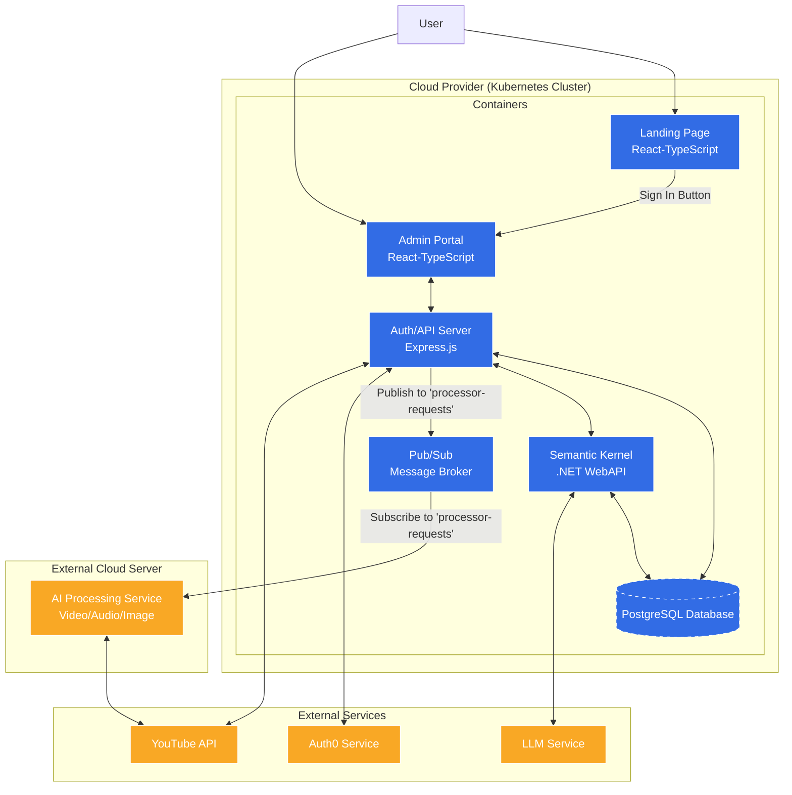

```mermaid
flowchart TD
    subgraph "Cloud Provider (Kubernetes Cluster)"
        subgraph "Containers"
            LP[Landing Page<br>React-TypeScript] 
            AP[Admin Portal<br>React-TypeScript]
            AUTH[Auth/API Server<br>Express.js]
            DB[(PostgreSQL Database)]
            SK[Semantic Kernel<br>.NET WebAPI]
            PS[Pub/Sub<br>Message Broker]
        end
    end
    
    subgraph "External Cloud Server" 
        AI[AI Processing Service<br>Video/Audio/Image]
    end
    
    subgraph "External Services"
        A0[Auth0 Service]
        YT[YouTube API]
        LLM[LLM Service]
    end
    
    %% User flows
    User-->LP
    LP--"Sign In Button"-->AP
    User-->AP
    
    %% Internal container connections
    AP<-->AUTH
    AUTH<-->DB
    AUTH<-->SK
    SK<-->DB
    
    %% Messaging layer connections
    AUTH--"Publish to 'processor-requests'"-->PS
    PS--"Subscribe to 'processor-requests'"-->AI
    
    %% External connections
    AUTH<-->A0
    AUTH<-->YT
    SK<-->LLM
    AI<-->YT
    
    %% Styling
    classDef container fill:#326ce5,stroke:#fff,stroke-width:1px,color:#fff
    classDef external fill:#f9a825,stroke:#fff,stroke-width:1px,color:#fff
    classDef database fill:#326ce5,stroke:#fff,stroke-width:1px,color:#fff,stroke-dasharray: 5 5
    
    class LP,AP,AUTH,SK,PS container
    class AI,A0,YT,LLM external
    class DB database
    
    %% Data flows
    classDef container fill:#326ce5,stroke:#fff,stroke-width:1px,color:#fff
    classDef external fill:#f9a825,stroke:#fff,stroke-width:1px,color:#fff
    classDef database fill:#326ce5,stroke:#fff,stroke-width:1px,color:#fff,stroke-dasharray: 5 5
    
    class LP,AP,AUTH,SK container
    class AI,A0,YT,LLM external
    class DB database
```