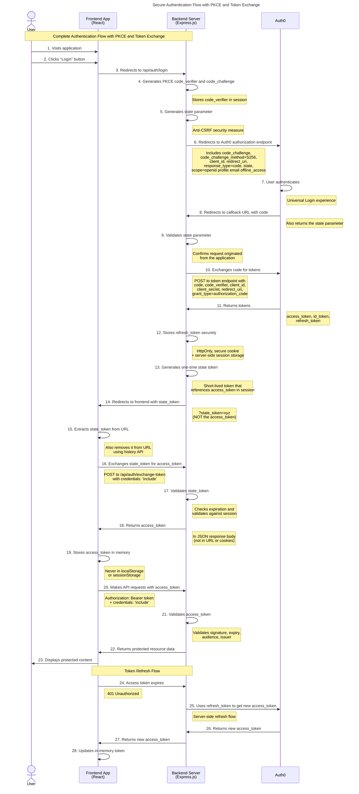

```mermaid
sequenceDiagram
    title Secure Authentication Flow with PKCE and Token Exchange
    
    actor User
    participant Frontend as Frontend App<br/>(React)
    participant Backend as Backend Server<br/>(Express.js)
    participant Auth0 as Auth0
    
    note over User, Backend: Complete Authentication Flow with PKCE and Token Exchange
    
    User->>Frontend: 1. Visits application
    User->>Frontend: 2. Clicks "Login" button
    
    Frontend->>Backend: 3. Redirects to /api/auth/login
    
    Backend->>Backend: 4. Generates PKCE code_verifier and code_challenge
    note right of Backend: Stores code_verifier in session
    
    Backend->>Backend: 5. Generates state parameter
    note right of Backend: Anti-CSRF security measure
    
    Backend->>Auth0: 6. Redirects to Auth0 authorization endpoint
    note right of Backend: Includes code_challenge,<br/>code_challenge_method=S256,<br/>client_id, redirect_uri,<br/>response_type=code, state,<br/>scope=openid profile email offline_access
    
    Auth0->>Auth0: 7. User authenticates
    note right of Auth0: Universal Login experience
    
    Auth0->>Backend: 8. Redirects to callback URL with code
    note right of Auth0: Also returns the state parameter
    
    Backend->>Backend: 9. Validates state parameter
    note right of Backend: Confirms request originated<br/>from the application
    
    Backend->>Auth0: 10. Exchanges code for tokens
    note right of Backend: POST to token endpoint with<br/>code, code_verifier, client_id,<br/>client_secret, redirect_uri,<br/>grant_type=authorization_code
    
    Auth0->>Backend: 11. Returns tokens
    note right of Auth0: access_token, id_token,<br/>refresh_token
    
    Backend->>Backend: 12. Stores refresh_token securely
    note right of Backend: HttpOnly, secure cookie<br/>+ server-side session storage
    
    Backend->>Backend: 13. Generates one-time state token
    note right of Backend: Short-lived token that<br/>references access_token in session
    
    Backend->>Frontend: 14. Redirects to frontend with state_token
    note right of Backend: ?state_token=xyz<br/>(NOT the access_token)
    
    Frontend->>Frontend: 15. Extracts state_token from URL
    note right of Frontend: Also removes it from URL<br/>using history API
    
    Frontend->>Backend: 16. Exchanges state_token for access_token
    note right of Frontend: POST to /api/auth/exchange-token<br/>with credentials: 'include'
    
    Backend->>Backend: 17. Validates state_token
    note right of Backend: Checks expiration and<br/>validates against session
    
    Backend->>Frontend: 18. Returns access_token
    note right of Backend: In JSON response body<br/>(not in URL or cookies)
    
    Frontend->>Frontend: 19. Stores access_token in memory
    note right of Frontend: Never in localStorage<br/>or sessionStorage
    
    Frontend->>Backend: 20. Makes API requests with access_token
    note right of Frontend: Authorization: Bearer token<br/>+ credentials: 'include'
    
    Backend->>Backend: 21. Validates access_token
    note right of Backend: Validates signature, expiry,<br/>audience, issuer
    
    Backend->>Frontend: 22. Returns protected resource data
    
    Frontend->>User: 23. Displays protected content
    
    note over Frontend, Backend: Token Refresh Flow
    Frontend->>Backend: 24. Access token expires
    note right of Frontend: 401 Unauthorized
    
    Backend->>Auth0: 25. Uses refresh_token to get new access_token
    note right of Backend: Server-side refresh flow
    
    Auth0->>Backend: 26. Returns new access_token
    
    Backend->>Frontend: 27. Returns new access_token
    
    Frontend->>Frontend: 28. Updates in-memory token
```